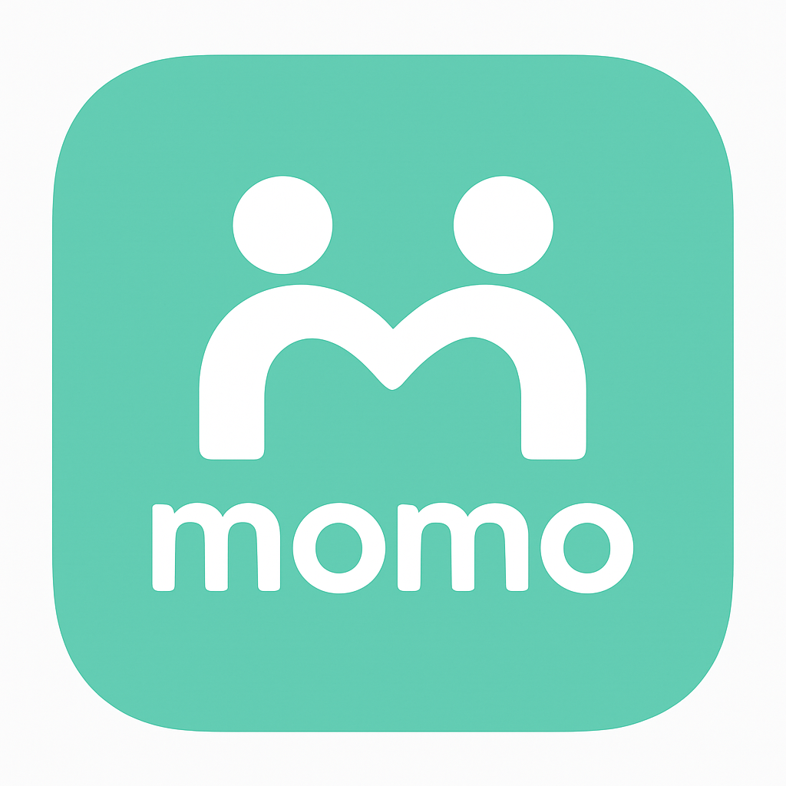
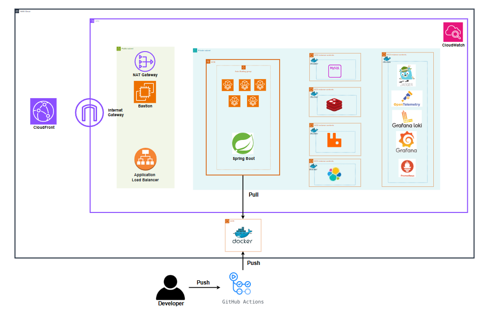
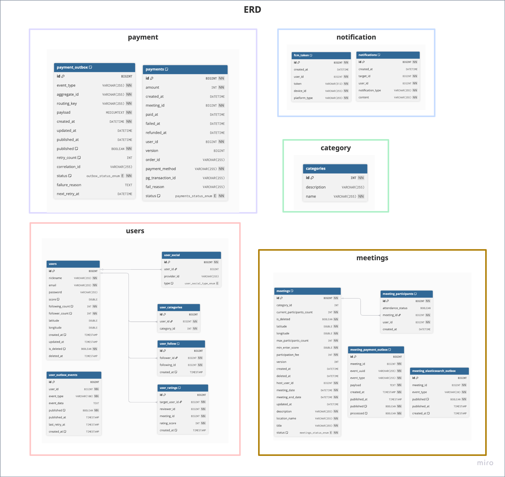
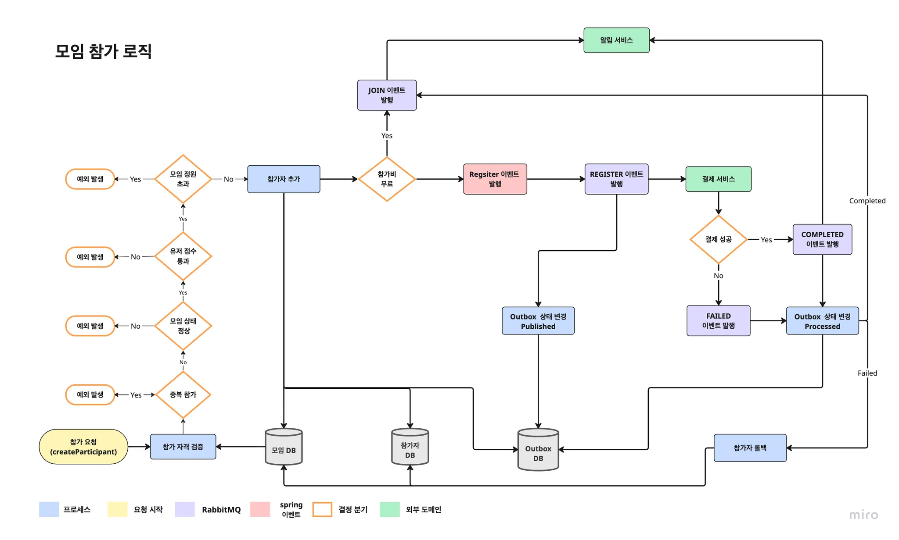
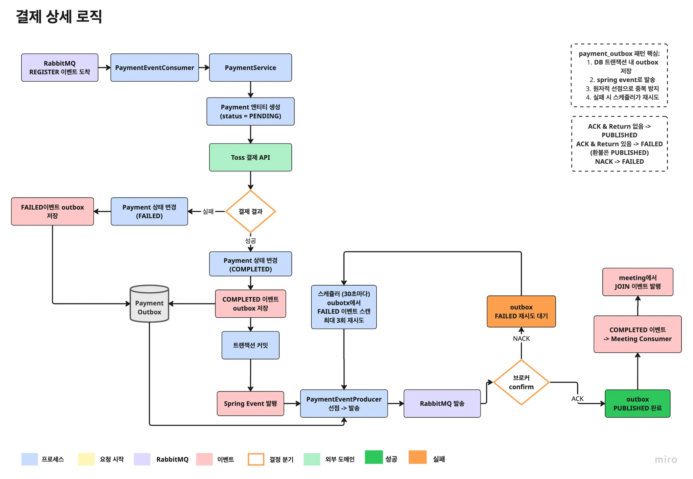
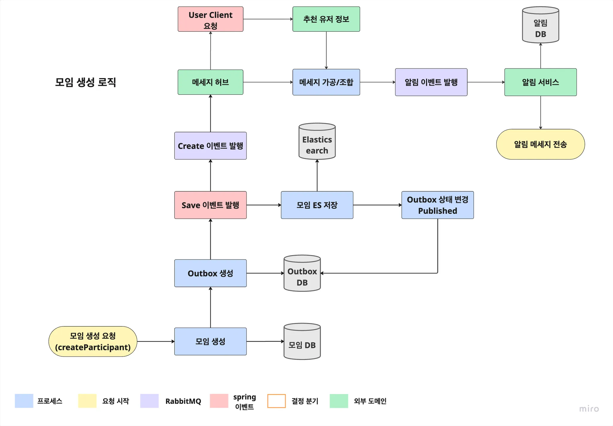

# MOMO 프로젝트

# 📋 목차

1. [팀원 소개](#1-팀원-소개)
2. [프로젝트 소개](#2-프로젝트-소개)
3. [기술 스택](#3-기술-스택)
4. [아키텍처](#4-아키텍처)
5. [프로젝트 설계](#5-프로젝트-설계)
6. [API 명세서](#6-api-명세서)
7. [주요 서비스 플로우](#7-주요-서비스-플로우)
8. [도메인 별 문서](#8-도메인-별-문서)
9. [기술적 의사결정](#9-기술적-의사결정)
10. [트러블 슈팅](#10-트러블-슈팅)
11. [5분 기록보드](#11-5분-기록보드)

---

# 1. 팀원 소개

&nbsp;&nbsp;&nbsp;&nbsp;

&nbsp;&nbsp;&nbsp;&nbsp;

<strong>차준호 (팀장)</strong>
&nbsp;&nbsp;&nbsp;&nbsp;&nbsp;&nbsp;&nbsp;&nbsp;&nbsp;&nbsp;&nbsp;&nbsp;&nbsp;&nbsp;
<strong>김신영 (부팀장)</strong>
&nbsp;&nbsp;&nbsp;&nbsp;&nbsp;&nbsp;&nbsp;&nbsp;&nbsp;&nbsp;&nbsp;&nbsp;&nbsp;&nbsp;
<strong>고동원 (팀원)</strong>

유저 도메인, 배포 인프라
&nbsp;&nbsp;&nbsp;&nbsp;&nbsp;&nbsp;&nbsp;&nbsp;
결제 도메인
&nbsp;&nbsp;&nbsp;&nbsp;&nbsp;&nbsp;&nbsp;&nbsp;&nbsp;&nbsp;&nbsp;
인증/인가, 배포 인프라

&nbsp;&nbsp;&nbsp;&nbsp;

&nbsp;&nbsp;&nbsp;&nbsp;

 

&nbsp;&nbsp;&nbsp;&nbsp;

&nbsp;&nbsp;&nbsp;&nbsp;

<strong>우지운 (팀원)</strong>
&nbsp;&nbsp;&nbsp;&nbsp;&nbsp;&nbsp;&nbsp;&nbsp;&nbsp;&nbsp;&nbsp;&nbsp;&nbsp;&nbsp;
<strong>임호진 (팀원)</strong>
&nbsp;&nbsp;&nbsp;&nbsp;&nbsp;&nbsp;&nbsp;&nbsp;&nbsp;&nbsp;&nbsp;&nbsp;&nbsp;&nbsp;
<strong>이의현 (팀원)</strong>

알림 도메인
&nbsp;&nbsp;&nbsp;&nbsp;&nbsp;&nbsp;&nbsp;&nbsp;&nbsp;&nbsp;&nbsp;
모임 참가, 모니터링
&nbsp;&nbsp;&nbsp;&nbsp;&nbsp;&nbsp;&nbsp;&nbsp;&nbsp;&nbsp;&nbsp;
모임 도메인

&nbsp;&nbsp;&nbsp;&nbsp;

&nbsp;&nbsp;&nbsp;&nbsp;

---

# 2. 프로젝트 소개

## 개발 기간: 2025.07.17 ~ 2025.08.25

## 왜 MOMO인가?

새로운 사람들과 만나고 싶지만 어디서 어떻게 시작해야 할지 모르는 분들을 위한 **지역 기반 모임 플랫폼**입니다.

## 핵심 가치

- **쉬운 모임 생성**: 몇 번의 클릭으로 모임 개설
- **안전한 만남**: 신뢰도 시스템으로 검증된 사용자
- **편리한 결제**: 토스페이먼츠 연동으로 간편 정산
- **알림 시스템**: 관심 모임, 주변 모임 생성 등 다양한 알림을 통해 모임을 참석, 관리

---

# 3. 기술 스택

## Framework

## Libraries

## Database & Cache

## Search & Messaging

## External API

## Security

## Monitoring & Test

## Development Tools

## Infra & CI/CD

---

# 4. 아키텍처

---

# 5. 프로젝트 설계

## 5.1 와이어프레임

## 5.2 ERD

## 5.3 패키지 구조

---

# 6. API 명세서

---

# 7. 주요 서비스 플로우

## 모임 참가

1. 사용자 모임 참가 신청
   사용자가 모임에 참가 신청하면 자격/정원/시간을 검증합니다.
2. 결제 요청 이벤트 기록/발행
   유료 모임이면 결제 정보를 생성하고 PG로 결제 승인을 시도합니다. (무료면 즉시 참가 완료)
3. 결과 반영
   결제가 성공하면 참가가 확정되고, 실패하면 신청이 취소 됩니다.
4. 알림 및 기록
   결과를 사용자/호스트에게 알림으로 보내고, 이력을 저장/발행 합니다.

---

---

## 모임 생성

1. 모임 등록
   호스트가 모임 정보를 입력하고 모임을 생성합니다.
2. 알림 준비
   create 이벤트가 메세지 허브로 전달되고
   메세지 허브에서 대상 사용자를 조회합니다.
   이후 메세지를 가공/조합 합니다.
3. 알림 발송
   알림 서비스에서 푸시/알림을 전송합니다.

---

---

# 8. 도메인 별 문서

---

# 9. 기술적 의사결정

---

# 10. 트러블 슈팅

---

# 11. 5분 기록보드

---